```mermaid
flowchart TD
    %% Client (Next.js Application) Subgraph
    subgraph "Client (Next.js Application)"
        direction TB
        CA["Client Application"] 
        subgraph "Pages"
            direction TB
            PP["Privacy Page"]
            AP["About Page"]
            CP["Community Page"]
            CN["Contact Page"]
            DP["Dashboard Page"]
            LP["Login Page"]
            SP["Signup Page"]
            TP["Terms Page"]
        end
        RUC["Reusable UI Components"]
        AC["Auth Context"]
        APB["API Bridge"]
        ST["Styling & Config"]
    end

    %% Server (Node.js Application) Subgraph
    subgraph "Server (Node.js Application)"
        direction TB
        SEP["Server Entry Point"]
        subgraph "Controllers"
            direction TB
            ACtr["Auth Controller"]
            ALCtr["Alert Controller"]
            PCtr["Profile Controller"]
            SCtr["Service Controller"]
        end
        subgraph "Routes"
            direction TB
            ARts["Auth Routes"]
            AlRts["Alert Routes"]
            PRts["Profile Routes"]
            URts["User Routes"]
            SRts["Service Routes"]
        end
        AM["Auth Middleware"]
        TG["Token Generation"]
        DBC["DB Config"]
    end

    %% Database Node
    DB["Database (Prisma Schema & Migrations)"]

    %% Connections from Client Pages to API Bridge
    PP ---|"API_call"| APB
    AP ---|"API_call"| APB
    CP ---|"API_call"| APB
    CN ---|"API_call"| APB
    DP ---|"API_call"| APB
    LP ---|"API_call"| APB
    SP ---|"API_call"| APB
    TP ---|"API_call"| APB

    %% Connection from API Bridge to Server Routes
    APB -->|"API_call"| ARts
    APB -->|"API_call"| AlRts
    APB -->|"API_call"| PRts
    APB -->|"API_call"| URts
    APB -->|"API_call"| SRts

    %% Routes to Controllers and Middleware
    ARts -->|"routes"| ACtr
    AlRts -->|"routes"| ALCtr
    PRts -->|"routes"| PCtr
    SRts -->|"routes"| SCtr
    ARts -->|"auth_check"| AM

    %% Server Entry Point connects to DB Config then Database
    SEP -->|"configures"| DBC
    DBC -->|"connects"| DB

    %% Controller using Utility Function
    ACtr -->|"generates"| TG

    %% Styling for clarity
    classDef frontend fill:#AED6F1,stroke:#1B4F72,stroke-width:2px;
    classDef backend fill:#F9E79F,stroke:#7D6608,stroke-width:2px;
    classDef database fill:#D5F5E3,stroke:#1D8348,stroke-width:2px;

    class CA,PP,AP,CP,CN,DP,LP,SP,TP,RUC,AC,APB,ST frontend;
    class SEP,ACtr,ALCtr,PCtr,SCtr,ARts,AlRts,PRts,URts,SRts,AM,DBC,TG backend;
    class DB database;

    %% Click Events for Client
    click CA "https://github.com/swapnil-m1d62y402/veera-nari-website/tree/main/client/app"
    click PP "https://github.com/swapnil-m1d62y402/veera-nari-website/blob/main/client/app/Privacy/page.tsx"
    click AP "https://github.com/swapnil-m1d62y402/veera-nari-website/blob/main/client/app/about/page.tsx"
    click CP "https://github.com/swapnil-m1d62y402/veera-nari-website/blob/main/client/app/Community/page.tsx"
    click CN "https://github.com/swapnil-m1d62y402/veera-nari-website/blob/main/client/app/Contact/page.tsx"
    click DP "https://github.com/swapnil-m1d62y402/veera-nari-website/blob/main/client/app/Dashboard/page.tsx"
    click LP "https://github.com/swapnil-m1d62y402/veera-nari-website/blob/main/client/app/Login/page.tsx"
    click SP "https://github.com/swapnil-m1d62y402/veera-nari-website/blob/main/client/app/Signup/page.tsx"
    click TP "https://github.com/swapnil-m1d62y402/veera-nari-website/blob/main/client/app/Terms/page.tsx"
    click RUC "https://github.com/swapnil-m1d62y402/veera-nari-website/tree/main/client/components"
    click AC "https://github.com/swapnil-m1d62y402/veera-nari-website/blob/main/client/context/AuthContext.tsx"
    click APB "https://github.com/swapnil-m1d62y402/veera-nari-website/blob/main/client/app/api/api.ts"
    click ST "https://github.com/swapnil-m1d62y402/veera-nari-website/blob/main/client/app/globals.css"
    click ST "https://github.com/swapnil-m1d62y402/veera-nari-website/blob/main/client/tailwind.config.js"

    %% Click Events for Server
    click SEP "https://github.com/swapnil-m1d62y402/veera-nari-website/blob/main/server/index.js"
    click ACtr "https://github.com/swapnil-m1d62y402/veera-nari-website/blob/main/server/controllers/authController.js"
    click ALCtr "https://github.com/swapnil-m1d62y402/veera-nari-website/blob/main/server/controllers/alertController.js"
    click PCtr "https://github.com/swapnil-m1d62y402/veera-nari-website/blob/main/server/controllers/profileController.js"
    click SCtr "https://github.com/swapnil-m1d62y402/veera-nari-website/blob/main/server/controllers/serviceController.js"
    click ARts "https://github.com/swapnil-m1d62y402/veera-nari-website/blob/main/server/routes/authRoutes.js"
    click AlRts "https://github.com/swapnil-m1d62y402/veera-nari-website/blob/main/server/routes/alertRoutes.js"
    click PRts "https://github.com/swapnil-m1d62y402/veera-nari-website/blob/main/server/routes/profileRoutes.js"
    click URts "https://github.com/swapnil-m1d62y402/veera-nari-website/blob/main/server/routes/userRoutes.js"
    click SRts "https://github.com/swapnil-m1d62y402/veera-nari-website/blob/main/server/routes/serviceRoutes.js"
    click AM "https://github.com/swapnil-m1d62y402/veera-nari-website/blob/main/server/middlewares/authMiddleware.js"
    click DBC "https://github.com/swapnil-m1d62y402/veera-nari-website/blob/main/server/config/db.js"
    click TG "https://github.com/swapnil-m1d62y402/veera-nari-website/blob/main/server/utils/generateToken.js"

    %% Click Event for Database
    click DB "https://github.com/swapnil-m1d62y402/veera-nari-website/tree/main/server/prisma"

```

# Veera-Nari-Website By Team Visionary

Empowering Women Through Technology – A full-stack web application for women's safety and support.

### 🧭 Client (Next.js Application)
- **Pages:**
  - Privacy, About, Community, Contact
  - Dashboard, Login, Signup, Terms
- **Core Modules:**
  - `Reusable UI Components`
  - `Auth Context`
  - `API Bridge`
  - `Styling & Config` (`globals.css`, `tailwind.config.js`)

### ⚙️ Server (Node.js Application)
- **Entry Point:** `index.js`
- **Controllers:**
  - Auth, Alert, Profile, Service
- **Routes:**
  - Auth, Alert, Profile, User, Service
- **Utilities:**
  - `Auth Middleware`
  - `Token Generator`
  - `DB Config`

### 🗄️ Database
- **Prisma ORM** with schema and migrations
- Connects from DB config to backend

## 🌐 Live Demo
_Coming Soon_

## 🧩 Tech Stack
## ✨ Features

- User authentication with secure token-based login
- Real-time alerts for emergencies
- User profile management
- Community support and resources
- Service directory for women's safety and empowerment
- Responsive design with reusable UI components
- Backend API with structured routes and controllers
- Database integration with Prisma ORM for seamless data management

### Client – [Next.js](https://nextjs.org/)
- **Pages:**
  - `/Privacy`, `/About`, `/Community`, `/Contact`
  - `/Dashboard`, `/Login`, `/Signup`, `/Terms`
- **Core Features:**
  - Reusable UI Components
  - Auth Context Provider
  - Central API Bridge (`api.ts`)
  - Global styling with Tailwind CSS

### Server – [Node.js](https://nodejs.org/) + [Express](https://expressjs.com/)
- **Controllers:**
  - `authController.js`
  - `alertController.js`
  - `profileController.js`
  - `serviceController.js`
- **Routes:**
  - `authRoutes.js`
  - `alertRoutes.js`
  - `profileRoutes.js`
  - `userRoutes.js`
  - `serviceRoutes.js`
- **Middleware:**
  - Authentication checks (`authMiddleware.js`)
- **Utilities:**
  - Token generation (`generateToken.js`)
  - Database configuration (`db.js`)

### Database – [Prisma ORM](https://www.prisma.io/)
- Schema definitions and migrations for relational DB
- Located under `server/prisma/`

## 📁 Project Structure

```bash
Veera-Nari-Website/
├── client/
│   ├── app/
│   │   ├── [Pages: about, community, contact, etc.]
│   ├── components/        # Reusable UI
│   ├── context/           # AuthContext
│   ├── api/               # API bridge
│   ├── globals.css        # Global styling
│   ├── tailwind.config.js
├── server/
│   ├── controllers/
│   ├── routes/
│   ├── config/
│   ├── middlewares/
│   ├── utils/
│   ├── prisma/            # Prisma schema & migrations
│   └── index.js           # Entry point
```

## 🚀 How to Run

### 1. Clone the repository
```bash
git clone https://github.com/swapnil-m1d62y402/veera-nari-website.git
cd veera-nari-website
```

### 2. Setup Client
```bash
cd client
npm install
npm run dev
```

### 3. Setup Server
```bash
cd server
npm install
npm run dev
```

### 4. Prisma DB Setup
```bash
cd server
npx prisma migrate dev
```


## 🤝 Contributing
Pull requests are welcome. For major changes, please open an issue first.
